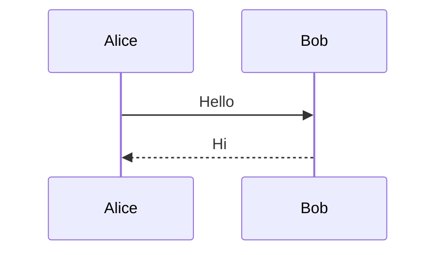
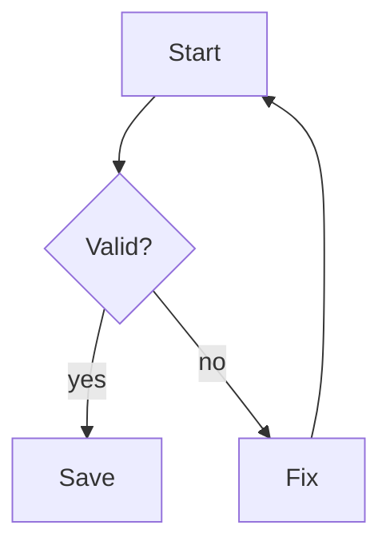
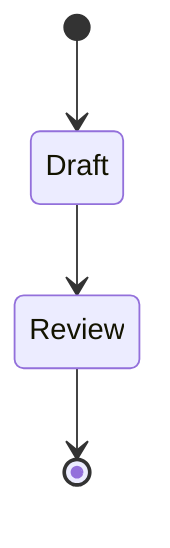

# Diagrams

Unchanged diagram:

```mermaid
sequenceDiagram
    Alice->>Bob: Hello
    Bob-->>Alice: Hi
```

Changed diagram:

```mermaid
flowchart TD
    Start --> Check{Valid?}
    Check -->|yes| Save
    Check -->|no| Fix
    Fix --> Start
```

Added diagram:

```mermaid
stateDiagram-v2
    [*] --> Draft
    Draft --> Review
    Review --> [*]
```

Diagram that breaks:

```mermaid
flowchart LR
    X --> Y -->
```
