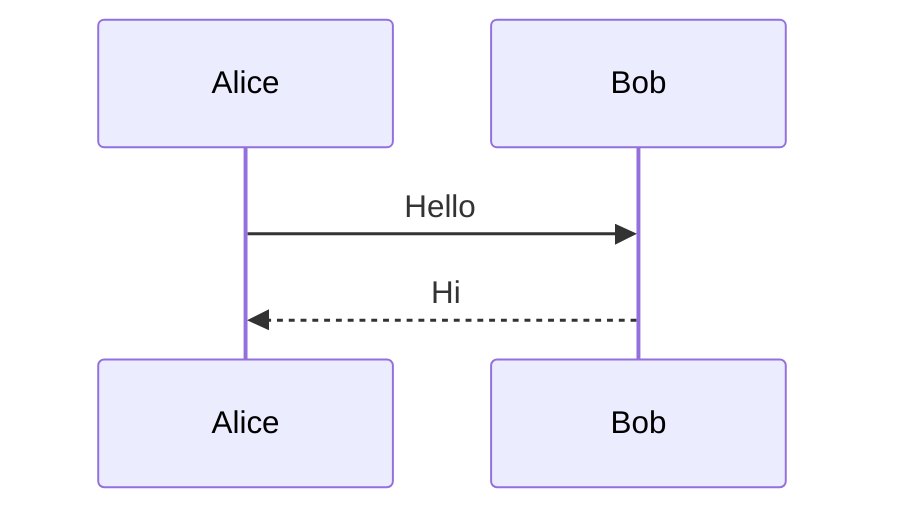
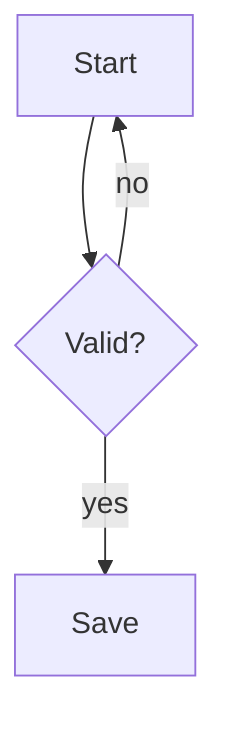
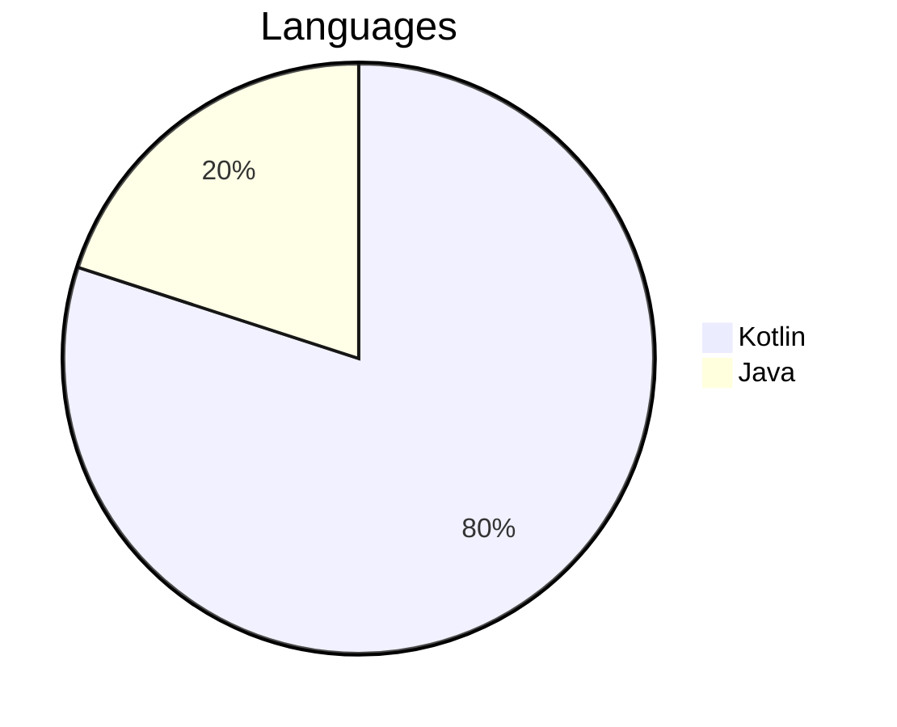
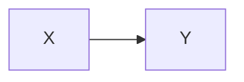

# Diagrams

Unchanged diagram:

```mermaid
sequenceDiagram
    Alice->>Bob: Hello
    Bob-->>Alice: Hi
```

Changed diagram:

```mermaid
flowchart TD
    Start --> Check{Valid?}
    Check -->|yes| Save
    Check -->|no| Start
```

Removed diagram:

```mermaid
pie title Languages
    "Kotlin" : 80
    "Java" : 20
```

Diagram that breaks:

```mermaid
flowchart LR
    X --> Y
```
